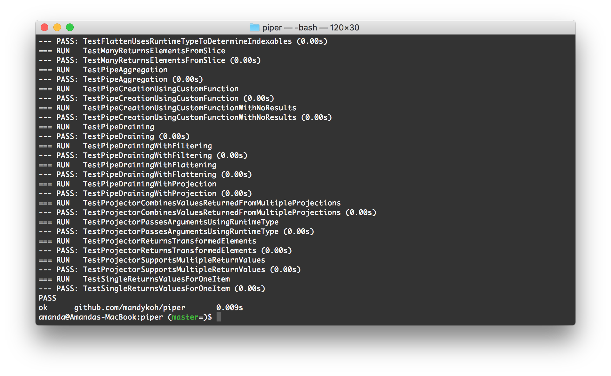
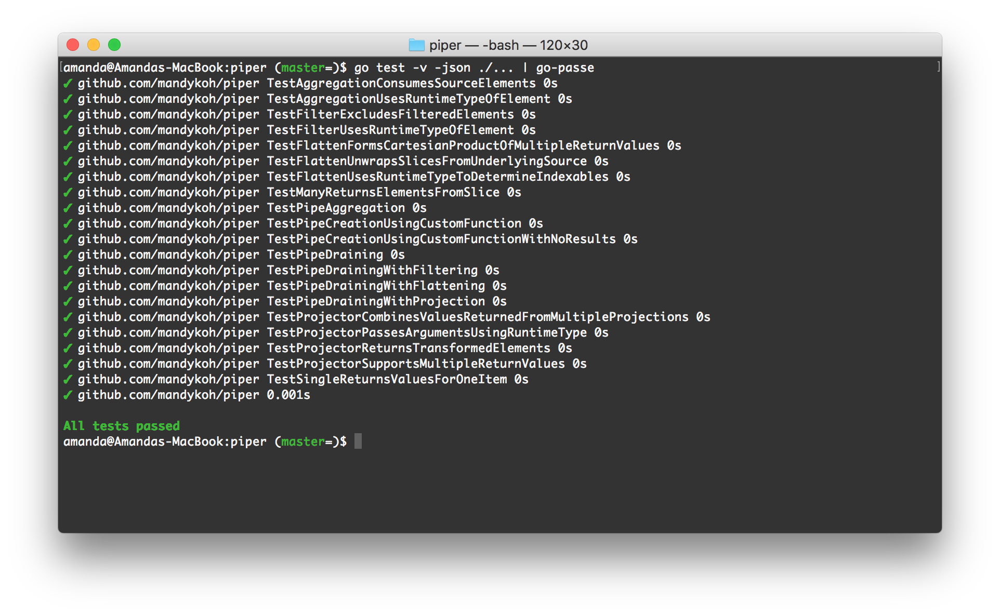
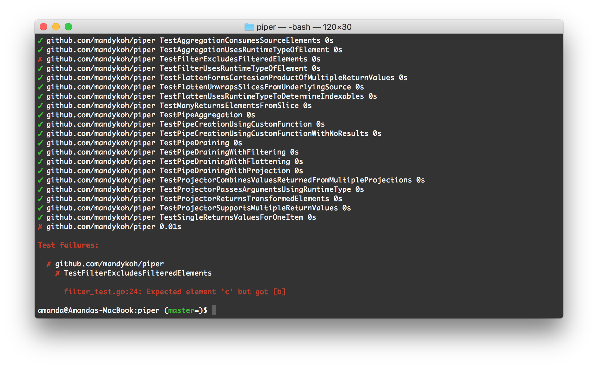

# go-passe

[](https://godoc.org/github.com/redbubble/go-passe)
[](https://goreportcard.com/report/github.com/redbubble/go-passe)
[](https://travis-ci.org/redbubble/go-passe)

Utility for neatly summarising Go JSON test output.

## Introduction

This allows the output from a `go test -json` command (the `-json` flag is
introduced in Go 1.10) to be piped into it for prettier formatting and more
easily identified test failures.

Example usage:

```
# Install this utility
$ go get -u github.com/redbubble/go-passe

# Run some tests
$ go test -v -json ./... | go-passe
```

### What it looks like

Without go-passe: `$ go test -v ./...`



With go-passe: `$ go test -v -json ./... | go-passe`



Test failures are summarised at the end for readability.

Without go-passe: `$ go test -v ./...`


With go-passe: `$ go test -v -json ./... | go-passe`




## Developing

`go-passe` uses `dep` for dependency management.

```
# Install dep if necessary
$ go get -u github.com/golang/dep/cmd/dep

# Ensure all dependencies are available/fetched
$ dep ensure
```

## License

go-passe, Copyright © 2018 Redbubble

This software is made available under an [MIT license](LICENSE).
